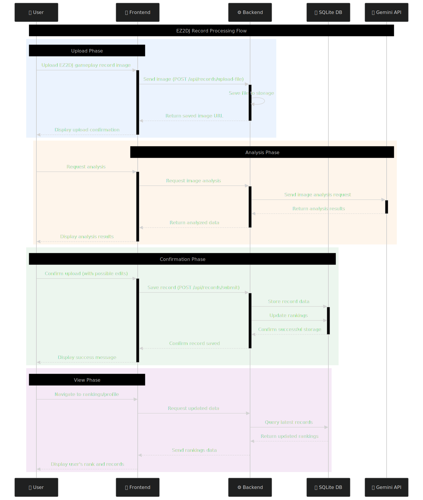
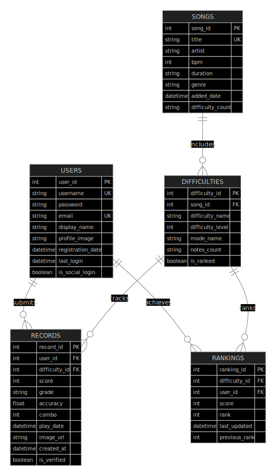

# EZ2Ranking

A modern web application for tracking and managing EZ2DJ gameplay records with an integrated ranking system.

## Structure

### Main Strcuture


---

### FlowChart


---

### DB Structure


## Project Overview

EZ2Ranking modernizes the record management and ranking system for EZ2DJ players, providing an efficient platform to track personal progress and compare with other players.

### Development Background
- Limited functionality in the existing game ranking system
- Inefficiency of managing records through image captures
- Difficulty in tracking personal progress over time

## Features

### User Authentication
- Account registration and login system
- Social login with Google OAuth
- Secure session management
- Password recovery functionality - **Not Implemented**

### Record Management
- Real-time camera capture for uploading scores
- Gallery image upload support
- DNG to JPG conversion support
- Automated score analysis using Google's Gemini Vision API:
  - Song name recognition
  - Difficulty level identification
  - Score and stats extraction
- Record editing and deletion

### Ranking System
- Song rankings by difficulty
- Global server rankings
- Personal best records management
- Advanced filtering and sorting options
- Automatic rank recalculation

### User Interface
- Mobile-optimized responsive web application
- Intuitive and user-friendly design
- Modern web standards (HTML5, CSS3, JavaScript)

## Technical Stack

### Frontend
- HTML5, CSS3, JavaScript
- Mobile-optimized responsive design

### Backend
- Node.js + Express.js
- RESTful API architecture
- SQLite database
- Authentication with bcrypt and Passport.js
- Session management with express-session
- File uploads with Multer
- Image processing with Sharp
- AI analysis with Google Gemini API

## API Endpoints

### Authentication
- `POST /api/auth/register` - Register new user
- `POST /api/auth/login` - Standard login
- `GET /auth/google` - Google OAuth login
- `POST /api/auth/logout` - Logout
- `GET /api/auth/me` - Current user info

### Records
- `POST /api/records/submit` - Submit new record
- `GET /api/records/user` - Get user's records
- `POST /api/records/analyze-image` - AI analysis of gameplay image
- `POST /api/convert/dng-to-jpg` - Convert DNG to JPG

### Rankings
- `GET /api/rankings` - Get global rankings
- `GET /api/rankings/difficulty/:difficultyId` - Rankings by difficulty
- `GET /api/rankings/user/:userId` - User rankings

## Database Structure

The system uses SQLite with these main tables:
- **users** - Account information
- **songs** - Song metadata
- **difficulties** - Difficulty levels per song
- **records** - User gameplay records
- **rankings** - Calculated ranking positions

## Security Features

- Password hashing with bcrypt
- Session-based authentication
- User authorization checks
- Secure file upload handling
- OAuth integration for Google login

## Installation & Setup

1. Clone the repository
2. Install dependencies:
   ```
   npm install
   ```
3. Configure environment variables in `.env`:
   ```
   PORT=1999
   SESSION_SECRET=your_secret
   GOOGLE_CLIENT_ID=your_client_id
   GOOGLE_CLIENT_SECRET=your_client_secret
   GOOGLE_CALLBACK_URL=your_callback_url
   GEMINI_API_KEY=your_gemini_api_key
   ```
4. Start the server:
   ```
   npm start
   ```

## Extensibility Considerations

- Modular architecture for future feature additions
- Infrastructure for incorporating user feedback
- Performance optimization strategies
- API versioning support

## License

The EZ2Ranking are licensed under CC-BY-NC-4.0.

## Contact

For detailed information, please contact me with Discord - ```ori_muchim```
